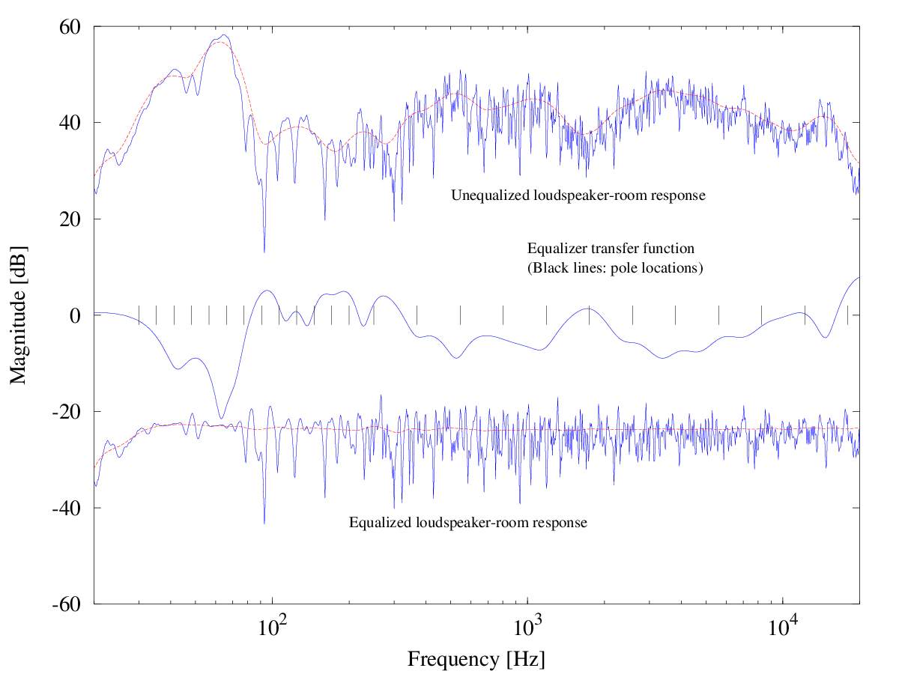

Python Open Room Correction (PORC)
==================================

DSP Loudspeaker-Room correction filter wizard; transfer function modeling and equalization 
by fixed-pole parallel filters. Algorithm ported to Python by Mason A. Green, based on the work 
of Dr. Balazs Bank: http://home.mit.bme.hu/~bank/parfilt/

 

More details about Dr. Bank's parallel filter can be found in the papers:

	Balazs Bank, "Perceptually Motivated Audio Equalization Using Fixed-Pole Parallel
	Second-Order Filters", IEEE Signal Processing Letters, 2008.

http://www.acoustics.hut.fi/go/spl08-parfilt

	Balazs Bank, "Direct Design of Parallel Second-order Filters for
	Instrument Body Modeling", International Computer Music Conference,
	Copenhagen, Denmark, Aug. 2007.

http://www.acoustics.hut.fi/go/icmc07-parfilt
	
Required Python dependencies:

	1) SciPy
	2) Numpy
	3) Matplotlib

Measurement
===========

One needs to measure the log-frequency impulse response of your speakers with a 
calibrated Electret Measurement Microphone, e.g. Dayton Audio EMM-6. Software 
such as Room EQ Wizard (REQ) may be used for this purpose:
http://www.hometheatershack.com/roomeq/

Usage
=====

porc.py [-h] [-t FILE] [-n NTAPS] I F

	python porc.py -t tact30f.txt -n 6148 l48.wav leq48.wav

Use the -h flag for help!

Use sox to convert output .wav to raw 32 bit IEEE floating point if necessary,
or to merge left and right channels into a stereo .wav 

	sox leq48.wav -t f32 leq48.bin
    sox -M le148.wav req48.wav output.wav

Target Response
===============

The default target curve for PORC is flat. Included in the data directory are a number 
of target curves. Experiment to suit your listening preferences (I prefer tact30f.txt, bk-48.txt, 
and pa-48.0.0.txt).

The B&K House Curve is a good place to start. Read "Relevant loudspeaker tests 
in studios in Hi-Fi dealers' demo rooms in the home etc," Figure 5:
http://www.bksv.com/doc/17-197.pdf

PC Convolution
==============

Windows (foobar 2000)
Linux (jconvolver w/ jcgui)

OpenDRC Convolution
===================

TODO
====

	Update this page with better documentation
	
